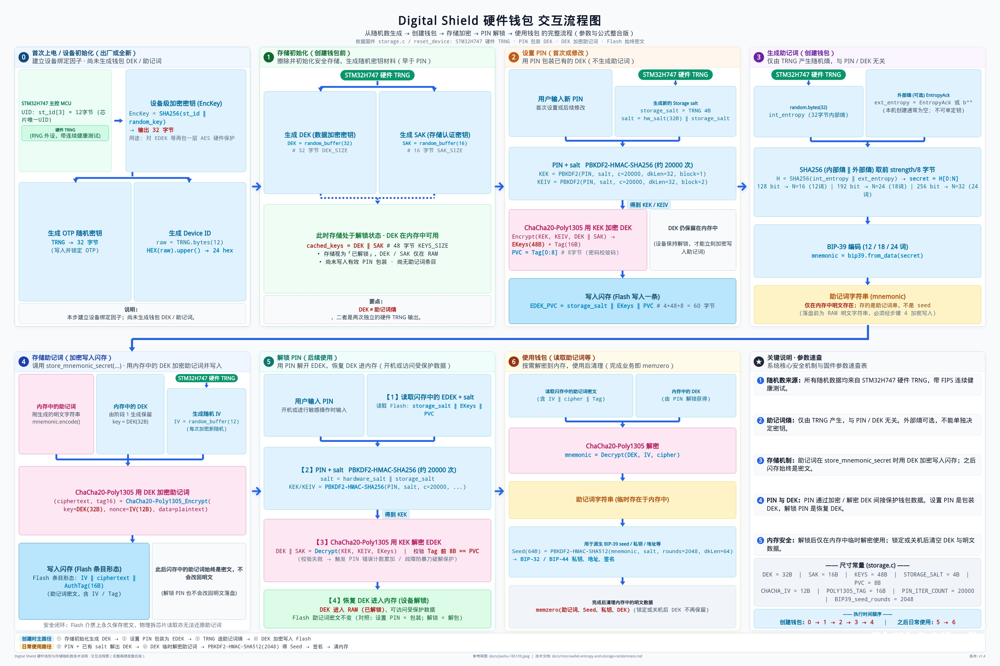

# Digital Shield Air-Gap Hot Wallet Developer Handbook

> **English** (current) &nbsp;|&nbsp; **简体中文** · [中文手册](./README.zh-CN.md)

> **Purpose**: For third-party hot / watch-only wallet teams integrating Digital Shield hardware via **account QR import** and **11-chain transfer QR signing**. Use this to build a scan-to-sign demo, then a product entry.  
> **Authoritative protocol fields**: CBOR keys / tags / `data_type` etc. are defined in §§5–11.  
> **Language**: English.

---
## Table of Contents

0. [Hardware Security (Creating / Storing the Seed Phrase)](#10-hardware-security-creating--storing-the-seed-phrase)
1. [Document Goals and Role Boundaries](#1-document-goals-and-role-boundaries)
2. [Supported 11 Chains Overview](#2-supported-11-chains-overview)
3. [End-to-End Interaction Model](#3-end-to-end-interaction-model)
4. [Device-Side Entry Points (Required for Integration)](#4-device-side-entry-points-required-for-integration)
5. [UR / Animated QR Transport Layer](#5-ur--animated-qr-transport-layer)
6. [Import Accounts: `crypto-multi-accounts`](#6-import-accounts-crypto-multi-accounts)
7. [Signing Overview and Common Conventions](#7-signing-overview-and-common-conventions)
8. [EVM Six Chains: `eth-sign-request`](#8-evm-six-chains-eth-sign-request)
9. [Bitcoin / Litecoin / Dogecoin: `crypto-psbt`](#9-bitcoin--litecoin--dogecoincrypto-psbt)
10. [TRON: `tron-sign-request`](#10-trontron-sign-request)
11. [Solana: `sol-sign-request`](#11-solanasol-sign-request)
12. [Hot Wallet Module Design Recommendations](#12-hot-wallet-module-design-recommendations)
13. [Demo Verification Plan (Recommended Rollout Order)](#13-demo-verification-plan-recommended-rollout-order)
14. [Security Checklist](#14-security-checklist)
15. [FAQ and Troubleshooting](#15-faq-and-troubleshooting)
16. [Appendix: Registry / Reference Implementations](#16-appendix-registry--reference-implementations)

---

## 1.0 Hardware Security (Creating / Storing the Seed Phrase)

Digital Shield hardware uses device-side random entropy during **wallet creation and seed-phrase custody**, and stores the seed phrase within the security boundary; the hot-side integration **never touches the seed phrase in plaintext**. The diagram below summarizes the full path from entropy source and seed derivation through account export, clarifying how “hardware-side security” relates to this handbook’s air-gap signing responsibilities:



- Full-size image: [Digital-Shield-Hardware-Wallet-Flow-Integrated.jpeg](./Digital-Shield-Hardware-Wallet-Flow-Integrated.jpeg) (this repository)
- The hot side should only persist public keys / xpubs / addresses and watch-only data such as `masterFingerprint`
- For the air-gap signing flow, see [Chapter 3](#3-end-to-end-interaction-model); for security checks, see [Chapter 14](#14-security-checklist)

---

## 1. Document Goals and Role Boundaries

### 1.1 What You Are Building

Third-party wallets add to their App:

1. **Scan the Digital Shield account QR code** → import accounts (covering up to 11 chains).
2. **Initiate transfers on each chain** → generate an unsigned QR → the user scans and confirms on the hardware → the App scans the signed QR → assemble the transaction and broadcast.

The entire flow uses **no USB / Bluetooth**—only QR exchange of [BC-UR](https://github.com/BlockchainCommons/Research/blob/master/papers/bcr-2020-005-ur.md) payloads.

### 1.2 Division of Responsibilities

| Role | Holds private keys | Responsibilities | Does not |
| --- | --- | --- | --- |
| **Hot-side App** (this handbook’s audience) | No | Scan account QR, build unsigned txs, show unsigned QR, scan signed QR, verify signatures, assemble raw, broadcast via own RPC | Does not store seed phrases; does not locally sign hardware accounts on the hot side |
| **Digital Shield hardware** | Yes | Export public-key accounts, scan unsigned QR, confirm on screen, sign, show signed QR | Does not connect to the network; does not broadcast |

### 1.3 Implementation Paths (Choose One or Combine)

| Approach | Description |
| --- | --- |
| **Build from this handbook** | Integrate BC-UR + CBOR Registry yourself; fields follow this document |
| **Use the official hot-side SDK** | An SDK dedicated to hot-wallet integration (see repo `digitalshield-airgap-sdk`). Shortens integration time; after integration it supports account import and air-gap signing for both the cold-wallet App and this hardware wallet. Still recommended to cross-check UR types / paths against this document |

Whichever approach you choose, **broadcast, balances, gas, and nodes** remain the integrating wallet’s own responsibility.

---

## 2. Supported 11 Chains Overview

Air-gap transfer signing covers **6 EVM + 5 non-EVM** chains.

**Overall import QR structure (independent of EVM / non-EVM):**

- The device exports only **one** account QR type: `UR:crypto-multi-accounts` (tag `1103`).
- This is a **whole-package container**: one animated QR carries extended public keys for multiple chains; it is not “one QR type for EVM and another for non-EVM.”
- Each item in the package’s `keys[]` is a concrete `crypto-hdkey` (tag `303`); the hot side picks the accounts needed in the table below by `coin_type` + path + `note`.

| # | Network | Chain ID / Coin Type | Import Account UR | HDKey Taken from multi-accounts | Sign Request UR | Signed Response UR |
| --- | --- | --- | --- | --- | --- | --- |
| 1 | Ethereum | `chain_id = 1` | `crypto-multi-accounts` (shared by 11 chains) | ETH `crypto-hdkey` (coin `60`) | `eth-sign-request` | `eth-signature` |
| 2 | BNB Chain | `56` | Same as above | Same (shared with ETH) | Same | Same |
| 3 | Polygon | `137` | Same as above | Same | Same | Same |
| 4 | X Layer | `196` | Same as above | Same | Same | Same |
| 5 | Arbitrum | `42161` | Same as above | Same | Same | Same |
| 6 | Base | `8453` | Same as above | Same | Same | Same |
| 7 | Bitcoin | SLIP-44 `0` | Same as above | Independent BTC HDKey (multiple scripts) | `crypto-psbt` | `crypto-psbt` |
| 8 | Litecoin | SLIP-44 `2` | Same as above | Independent LTC HDKey | `crypto-psbt` (or `crypto-psbt-extend`) | Same as request type |
| 9 | Dogecoin | SLIP-44 `3` | Same as above | Independent DOGE HDKey | Same | Same |
| 10 | TRON | SLIP-44 `195` | Same as above | Independent TRX HDKey | `tron-sign-request` | `tron-signature` |
| 11 | Solana | SLIP-44 `501` | Same as above | Independent SOL HDKey (ed25519) | `sol-sign-request` | `sol-signature` |

Key points:

- **Import UR**: Always an animated `UR:CRYPTO-MULTI-ACCOUNTS/…` code (exported via device “Connect App → QR → Digital Shield”). The table’s “HDKey Taken” only indicates which entries to recognize from that UR’s `keys[]`; it does **not** mean there is another import UR type.
- **EVM six chains**: Import only one set of `m/44'/60'/…` extended public keys; the six chains share the same addresses and are distinguished at signing by `chain_id`. For multiple addresses, use the **last** address index: `m/44'/60'/0'/0/i`.
- **BTC / LTC / DOGE**: Import HDKeys by coin type + script type; **multiple accounts use the BIP44 third-segment account number** (aligned with Digital Shield hot wallet “Add account”): `m/{purpose}'/{coin}'/{i}'/0/0`. Signing is typically BIP-174 PSBT. LTC/DOGE may also use Keystone-style `crypto-psbt-extend` (see Chapter 9).
- The device-exported QR **may also contain** Polkadot, Aptos, Ledger-compatible paths, etc.; **at this stage third parties only need to parse the HDKeys required for the 11 chains above—others may be ignored**. Firmware currently **does not provide air-gap signing URs for DOT/Aptos**.

---

## 3. End-to-End Interaction Model


### 3.1 Import Accounts (One-Way: Device → App)

```
┌──────────────┐   Animated UR:crypto-multi-accounts    ┌──────────────┐
│ Digital Shield│ ─────────────────────────────────────▶ │  Hot Wallet  │
│ Shows account │                                        │ App scans &  │
│ QR code       │                                        │ persists     │
└──────────────┘                                        └──────────────┘
```

The App **does not need** to send anything back to the device.

### 3.2 Air-Gap Signing (Two-Way)

```
Hot wallet: Build unsigned tx → Encode Sign Request → Show animated QR
    │
    ▼  User scans with hardware camera
Hardware: Parse → Show recipient/amount/network on screen → User confirms → Sign
    │
    ▼  Hardware shows Signature animated QR
Hot wallet: Scan signed QR → Verify request_id → Assemble signed tx → Broadcast
```

`request_id` (16-byte UUID) must match between request and signed response, binding the session and preventing scanning a QR from another transaction.

### 3.3 Session State (Hot Side Must Maintain)

Recommended to keep `pendingSign` in memory (clear after signing completes or times out):

```text
pendingSign = {
  requestId,          // UUID bytes / hex
  chain,              // eth | bsc | … | btc | ltc | doge | trx | sol
  urTypeRequest,      // eth-sign-request | crypto-psbt | …
  unsignedPayload,    // RLP / PSBT / raw_data / sol message
  derivationPath,
  masterFingerprint,  // xfp from import
  fromAddress,
  meta                // amount, to, symbol, and other UI info
}
```

---

## 4. Device-Side Entry Points (Required for Integration)

### 4.1 Export Account QR (For the Hot Wallet to Scan)

Typical path (firmware UI):

1. Unlock the device and enter the home screen.
2. Enter **Connect App / Connect**.
3. Choose the **QR code** connection method.
4. Select **Digital Shield**.
5. The device displays an **animated** `UR:CRYPTO-MULTI-ACCOUNTS/…` QR code.

The hot wallet continuously scans frames until UR decoding completes.

### 4.2 Scan Unsigned QR (Hardware Signs the Transaction)

1. The hot wallet displays the unsigned animated QR.
2. The device enters scan mode (home-screen scan / connect-related scan entry, depending on firmware version).
3. After all fragments are scanned, the device parses the UR type → enters the corresponding chain confirmation page.
4. After user confirmation, the device displays the signed animated QR.
5. The hot wallet scans the signed response.

### 4.3 Device Account QR Encoding Parameters (Align with Hot-Side Display Recommendations)

| Parameter | Common device-side values | Hot-side recommendation |
| --- | --- | --- |
| UR fragment length `max_fragment_len` | Account export ~**100** bytes | Unsigned QR recommend **100–200**; too large easily causes device recognition failure |
| Animation refresh | ~**250 ms** order of magnitude | **200–500 ms**; too fast and the camera cannot keep up; too slow hurts UX |
| String case | Uppercase `UR:…` | **Always uppercase** |
| QR error correction | Device display side decides | Display side recommend ECC **M or Q**; when too dense, prefer smaller fragments rather than endlessly raising ECC |

---

## 5. UR / Animated QR Transport Layer

### 5.1 Format

| Form | String form | Description |
| --- | --- | --- |
| Single frame | `UR:<TYPE>/<bytewords>` | Shorter payload |
| Multi-frame (Fountain) | `UR:<TYPE>/<SEQ>-<TOTAL>/<bytewords>` | Loop playback; decoder collects until `isComplete()` |

`<TYPE>` is the registry type name (e.g. `CRYPTO-MULTI-ACCOUNTS`, `ETH-SIGN-REQUEST`). Bytewords uses BC-UR minimal encoding.

### 5.2 Required Hot-Side Capabilities

1. **Encoder (display side)**: Encode business objects to CBOR, then wrap as BC-UR; split into ordered (or Fountain) fragment string lists by the agreed `max_fragment_len`; the UI cycles them at a fixed interval.
2. **Decoder (scan side)**: Camera recognizes QR text frame by frame, continuously feeds `receivePart(frame)` into the decoder until `isComplete()`; then extract the UR `type` and full `cborBytes`, and hand off to Registry deserialization.
3. **Registry**: Encode/decode each business object per this document’s Map Keys.

Recommended open-source stacks (language-agnostic; conceptual equivalents are fine):

- UR: Blockchain Commons `bc-ur` / ecosystem JS, Swift, Kotlin ports
- CBOR: Standard CBOR libraries
- Business objects: May reference same-named types in the Keystone `ur-registry` ecosystem (fields follow **this document**)

### 5.3 Progress UI Recommendations

The decoder should show received fragment count, estimated total, or completion percentage so users can aim the camera. Fragment count is determined jointly by payload size and `max_fragment_len`: multi-frame is normal for `crypto-multi-accounts`, large PSBTs, etc.; even smaller `eth-sign-request` payloads may split into multiple frames when fragment length is conservative. Both hot side and hardware must implement **multi-frame completion**; do not assume any business type is always single-frame.

---

## 6. Import Accounts: `crypto-multi-accounts`

### 6.1 Type

| Item | Value |
| --- | --- |
| UR type | `crypto-multi-accounts` |
| CBOR tag (outer object) | `1103` |

### 6.2 Outer CBOR Map

| Key | Field | Type | Required | Description |
| --- | --- | --- | --- | --- |
| `1` | `masterFingerprint` | uint32 | Yes | Wallet master fingerprint (xfp); **must be passed back on subsequent signatures** |
| `2` | `keys` | array of tagged `crypto-hdkey` (303) | Yes | Multi-chain / multi-script extended public keys |
| `3` | `device` | text | No | Device name |
| `4` | `deviceId` | text | No | Device ID |
| `5` | `deviceVersion` | text | No | Firmware version |

The hot side should persist: `masterFingerprint`, `deviceId` (if present), and selected account metadata per chain.

### 6.3 `crypto-hdkey` (tag `303`)

| Key | Field | Type | Description |
| --- | --- | --- | --- |
| `2` | `is_private` | bool | Always `false` |
| `3` | `key_data` | bytes | secp256k1 compressed public key 33B; Solana is ed25519 public key 32B |
| `4` | `chain_code` | bytes | 32B; usually absent for Solana |
| `5` | `use_info` | tagged `crypto-coin-info` (305) | coin type + network |
| `6` | `origin` | tagged `crypto-keypath` (304) | Derivation path + source fingerprint |
| `7` | `children` | tagged `crypto-keypath` (304) | Relative derivable path (may be omitted) |
| `8` | `parent_fingerprint` | uint32 | Parent fingerprint |
| `9` | `name` | text | Optional |
| `10` | `note` | text | Account type marker; see table below |

`crypto-coin-info`:

| Key | Field | Value |
| --- | --- | --- |
| `1` | `coin_type` | BTC `0`, LTC `2`, DOGE `3`, ETH `60`, TRX `195`, SOL `501` |
| `2` | `network` | `0` = MainNet |

`crypto-keypath`:

| Key | Field | Description |
| --- | --- | --- |
| `1` | `components` | `[index, hardened, …]`; wildcards are empty + hardened |
| `2` | `source_fingerprint` | Same xfp as masterFingerprint |
| `3` | `depth` | Path depth |

### 6.4 How to Select the 11 Chain Accounts (Do Not Use Array Index)

Match by **`use_info.coin_type` + `origin` path + `note`**:

| Chain | note (preferred) | origin path (account #0) | Curve | How address / multi-account is obtained |
| --- | --- | --- | --- | --- |
| EVM six chains shared | `account.standard` | `m/44'/60'/0'` | secp256k1 | Further derive `0/i` → i-th address (last address index) |
| Bitcoin Legacy | `account.btc_legacy` | `m/44'/0'/0'` | secp256k1 | Account i: `m/44'/0'/i'/0/0` (third-segment account number) |
| Bitcoin Nested SegWit | `account.btc_segwit` | `m/49'/0'/0'` | secp256k1 | Account i: `m/49'/0'/i'/0/0` |
| Bitcoin Native SegWit | `account.btc_native_segwit` | `m/84'/0'/0'` | secp256k1 | Account i: `m/84'/0'/i'/0/0` (recommended default script) |
| Bitcoin Taproot | `account.btc_taproot` | `m/86'/0'/0'` | secp256k1 | Account i: `m/86'/0'/i'/0/0` (BIP86, x-only + tweak) |
| Litecoin Legacy | `account.ltc_legacy` | `m/44'/2'/0'` | secp256k1 | Account i: `m/44'/2'/i'/0/0` |
| Litecoin Nested SegWit | `account.ltc_segwit` | `m/49'/2'/0'` | secp256k1 | Account i: `m/49'/2'/i'/0/0` |
| Litecoin Native SegWit | `account.ltc_native_segwit` | `m/84'/2'/0'` | secp256k1 | Account i: `m/84'/2'/i'/0/0` (recommended default script) |
| Dogecoin | `account.standard` | `m/44'/3'/0'` | secp256k1 | Account i: `m/44'/3'/i'/0/0` |
| TRON | `account.standard` | `m/44'/195'/0'` | secp256k1 | Further derive `0/i` → i-th address (Base58Check) |
| Solana | `account.standard` | `m/44'/501'/0'/0'` | ed25519 | Path already at address level; use `key_data` directly; multi-account often `m/44'/501'/i'/0'` |
| Solana Ledger Live | `account.ledger_live` | `m/44'/501'/0'` | ed25519 | Compatibility path, as needed |

May appear but can be ignored at this stage: `account.ledger_legacy` / `account.ledger_live` (ETH), Polkadot (`354`), Aptos (`637`), etc.

#### 6.4.1 UTXO Multi-Account Indexing (Aligned with Digital Shield Hot Wallet)

For BTC / LTC / DOGE, do **not** use “incrementing last `0/i` under the same account” to represent hot-wallet “account #0 / #1 / #2”:

```text
m/{purpose}'/{coinType}'/$$INDEX$$'/0/0
```

| Hot wallet / logical index | Full receive path (Legacy BTC example) | Account-level path in hardware multi-accounts |
| --- | --- | --- |
| `#0` | `m/44'/0'/0'/0/0` | `m/44'/0'/0'` |
| `#1` | `m/44'/0'/1'/0/0` | `m/44'/0'/1'` |
| `#2` | `m/44'/0'/2'/0/0` | `m/44'/0'/2'` |

Notes:

- Digital Shield hot wallet UI often shows “Account #1” for logical index `#0` (UI counts from 1).
- Device-exported `crypto-multi-accounts` usually includes at least account `#0` HDKeys for each script; to show `#1`, `#2`, the seed-aware hot side derives them per the table above.
- From an account-level HDKey (`…/i'`), obtain the receive address by further deriving relative path `0/0` (change=0, address_index=0).
- **Contrast**: EVM / TRON remain `m/44'/{coin}'/0'/0/i` (third segment fixed `0'`, last segment is address index).

### 6.5 Minimum Set the Hot Side Should Store After Import

```text
ImportedDevice = {
  masterFingerprintHex,   // 8-char lowercase hex, e.g. "caeff70f"
  deviceId?, deviceVersion?, deviceName?,
  accounts: [
    {
      chainFamily,        // evm | btc | ltc | doge | tron | sol
      note, coinType, path,   // UTXO: account-level e.g. m/84'/0'/0'; full receive path stored separately or append /0/0
      publicKey, chainCode?,
      accountIndex,       // UTXO: BIP44 third segment; EVM: last address index
      receiveAddress,     // Default display address (UTXO is …/i'/0/0)
      xpub?               // Optional for UTXO
    }
  ]
}
```

---

## 7. Signing Overview and Common Conventions

### 7.1 Request / Signed Response Mapping

| Chain family | Scan hot side → device | Scan device → hot side |
| --- | --- | --- |
| EVM × 6 | `eth-sign-request` (401) | `eth-signature` (402) |
| BTC | `crypto-psbt` (310) | `crypto-psbt` (310) |
| LTC / DOGE | `crypto-psbt` (310) **or** `crypto-psbt-extend` (312) | Same type as request |
| TRON | `tron-sign-request` (5201) | `tron-signature` (5202) |
| Solana | `sol-sign-request` (1101) | `sol-signature` (1102) |

> **Compatibility note (not this handbook’s primary path)**: Some third-party Apps use `keystone-sign-request` / `keystone-sign-result` for TRON (gzip + protobuf). Digital Shield firmware can recognize that path, but **third-party self-built hot wallets should prefer native `tron-sign-request`**, which is simpler to implement with clearer fields.

### 7.2 UUID (tag `37`)

`request_id`: 16-byte UUID, returned unchanged in the signed response. The hot side uses it to match `pendingSign`.

### 7.3 Derivation Path (tag `304`)

Must be a **complete path with no wildcards**, and `source_fingerprint` = the imported xfp. The device uses this to verify the current wallet; mismatch rejects signing.

Examples:

- EVM address #0: `m/44'/60'/0'/0/0`; address #1: `m/44'/60'/0'/0/1`
- BTC Native SegWit account #0: `m/84'/0'/0'/0/0`; account #1: `m/84'/0'/1'/0/0`
- BTC Legacy account #0: `m/44'/0'/0'/0/0`; account #1: `m/44'/0'/1'/0/0`
- TRON: `m/44'/195'/0'/0/0`
- Solana: `m/44'/501'/0'/0'`

### 7.4 `origin` Text (Optional, Display Only)

The device confirmation page may show a host name; if token info is needed for display, append query-string style extras (**does not affect the signed bytes themselves**):

```text
MyWallet&symbol=USDT&decimals=6&amount=1000000
```

Solana may also append:

```text
MyWallet&symbol=SOL&decimals=9&amount=1000000&toAddress=<base58>
```

---

## 8. EVM Six Chains: `eth-sign-request`

All six chains share the protocol; networks are distinguished by `chain_id`.

### 8.1 Request Fields

| Key | Field | Type | Required | Description |
| --- | --- | --- | --- | --- |
| `1` | `request_id` | tagged UUID (37) | Strongly recommended | 16 bytes |
| `2` | `sign_data` | bytes | Yes | See `data_type` |
| `3` | `data_type` | uint | Yes | See table below |
| `4` | `chain_id` | uint | Yes | `1/56/137/196/42161/8453` |
| `5` | `derivation_path` | tagged crypto-keypath | Yes | Full path + xfp |
| `6` | `address` | bytes | Recommended | 20 bytes, for device display |
| `7` | `origin` | text | No | See 7.4 |

| `data_type` | Meaning | `sign_data` |
| --- | --- | --- |
| `1` | Legacy Transaction | RLP(`[nonce, gasPrice, gasLimit, to, value, data, v, r, s]`), with v/r/s empty placeholders |
| `2` | EIP-712 Typed Data | UTF-8 JSON |
| `3` | personal_sign | Raw message (without `\x19Ethereum Signed Message:\n` prefix) |
| `4` | EIP-1559 | `0x02 \|\| rlp([chainId, nonce, maxPriorityFeePerGas, maxFeePerGas, gasLimit, to, value, data, accessList])` |

**Transfer verification demos should prioritize `data_type = 4` (EIP-1559)**; some chains may still use Legacy (`1`).

### 8.2 Signed Response `eth-signature`

| Key | Field | Description |
| --- | --- | --- |
| `1` | `request_id` | Matches the request |
| `2` | `signature` | See below |
| `3` | `origin` | May be ignored |

| Transaction type | Signature encoding |
| --- | --- |
| EIP-1559 | `r(32) \|\| s(32) \|\| v(1)`, `v` is y-parity (0/1) |
| Legacy | `r(32) \|\| s(32) \|\| v(4, big-endian)`, already includes EIP-155 |
| Message types | 65-byte secp256k1 |

Hot side: fill back `r/s/v` → serialize raw → locally recover address to verify → broadcast.

### 8.3 EVM Transfer End-to-End Steps (Outline)

> Covers the full integration order from building the unsigned QR → hardware signing → scanning the signed response → broadcast; not a formal protocol constraint. Fields and encoding follow 8.1 / 8.2.

```text
1. Select network chainId; select from = imported address index 0
2. Fetch nonce / suggested gas (own RPC)
3. Build unsigned EIP-1559 bytes → eth-sign-request
4. Show UR animation
5. Scan eth-signature → assemble → eth_sendRawTransaction
```

---

## 9. Bitcoin / Litecoin / Dogecoin: `crypto-psbt`

### 9.1 Standard Path: `crypto-psbt` (Recommended Primary Path for Self-Built Hot Wallets)

| Item | Description |
| --- | --- |
| UR type | `crypto-psbt` (tag `310`) |
| CBOR | **Single bytes segment** = BIP-174 PSBT binary |
| Request | Hot-side constructed **unsigned** PSBT (must include UTXO / derivation fields; see 9.1.1) |
| Signed response | Also `crypto-psbt`; CBOR is still a single PSBT bytes segment, but signature fields are written into the corresponding inputs (see below) |

**Signature fields written by the device on signed response (consistent with firmware behavior):**

| Script | Signed PSBT input field | Description |
| --- | --- | --- |
| Legacy / Nested SegWit / Native SegWit / DOGE | BIP-174 `partial_sigs` | map: **key** = compressed public key; **value** = DER signature ‖ sighash type byte. Single-sig transfers commonly use `SIGHASH_ALL = 0x01` |
| Taproot (P2TR) key-path | BIP-371 `tap_key_sig` | Schnorr signature; do not expect ordinary `partial_sigs` |

UTXO, scripts, `bip32_derivation`, and other metadata on global / inputs / outputs are generally preserved as-is for hot-side `finalize`.

**After the hot side receives the signed response (summary; step-by-step in 9.1.2):** Parse the signed PSBT → verify it matches the current pending session and signature fields are complete → `finalize` (produce `final_scriptsig` / `final_scriptwitness`) → `extractTransaction` for network-layer raw → broadcast via own node / explorer API. **Encode/decode and address network parameters must match the coin** (do not use Bitcoin mainnet parameters for LTC / DOGE).

#### 9.1.1 Fields Each Unsigned PSBT Input Should Have (BIP-174 / BIP-371)

The device uses these fields to identify “whose funds are being spent and which path to sign with.” Missing fields or mismatched path/xfp may prevent display or reject signing.

| Address / script type | Required / strongly recommended | Description |
| --- | --- | --- |
| Legacy / Nested SegWit / Native SegWit | `non_witness_utxo` **or** `witness_utxo` | Legacy / DOGE commonly use the full previous transaction (`non_witness_utxo`); SegWit may use `witness_utxo` (script + amount) |
| Nested SegWit (P2SH-P2WPKH) | Additionally `redeem_script` | Must match the address script |
| Above non-Taproot scripts | `bip32_derivation` | BIP-174: map **keyed by compressed public key**; value = `master_fingerprint` (4 bytes) + full derivation path index sequence. Logically `{ pubkey → { fingerprint, path } }`; xfp must match import; `path` is the full path (see 9.2) |
| Taproot (P2TR) | `witness_utxo` + `tap_internal_key` + `tap_bip32_derivation` | Follow **BIP-371**: internal key is x-only (32 bytes); `tap_bip32_derivation` is also keyed by public key; for key-path spends leaf hashes are usually empty. Do not fill Taproot with only ordinary `bip32_derivation` |
| **Change output** (output role, not a script name) | Also write `bip32_derivation` on the output side (Taproot uses `tap_bip32_derivation` + `tap_internal_key`) | Path/xfp/pubkey must match the send address. The device uses this to recognize the output as change and **only confirm the external transfer amount**; if omitted, firmware treats change as a second recipient and prompts for another signing confirmation |

Field semantics notes:

- `bip32_derivation` / `tap_bip32_derivation` in PSBT are **key-value maps (key = public key)**, not “plain lists of paths only.” Language library API shapes may differ, but once encoded into PSBT they must conform to BIP-174 / BIP-371.
- Fee estimation, UTXO selection, change, etc. are hot-side local construction logic, **not** fields of this UR protocol; when implementing, use integer sats for amounts and fees—avoid floats entering the serialization layer.

#### 9.1.2 Hot-Side Steps After Signed Response

1. Decode the signed UR to get signed PSBT bytes; confirm UR type is still `crypto-psbt` (if using 9.3 extend, type and `coinId` must match the request).
2. Check each input has the required signature fields: non-Taproot = `partial_sigs`; Taproot key-path = `tap_key_sig`. If signatures are missing or cannot be matched to public keys in `bip32_derivation` / `tap_bip32_derivation`, abort—do not broadcast.
3. Call the library’s PSBT `finalize` (or equivalent) to produce each input’s `final_scriptsig` / `final_scriptwitness`.
4. `extractTransaction` (or equivalent) to extract broadcastable raw transaction hex / bytes.
5. Broadcast via own full node, RPC, or trusted explorer API; the broadcast path is **not** part of the air-gap UR protocol itself.

#### 9.1.3 UTXO Transfer End-to-End Steps (Outline)

> Covers select UTXO → build unsigned PSBT → hardware signing → scan signed response → broadcast; not a formal protocol constraint. Fields follow 9.1 / 9.1.1 / 9.1.2.

```text
1. Select network (btc / ltc / doge) and script type; select account i (paths in 9.2)
2. Fetch UTXOs, estimate fees, build unsigned PSBT (including change-output derivation info)
3. Encode as crypto-psbt → show UR animation
4. Scan signed crypto-psbt → finalize → extractTransaction
5. Broadcast raw; confirm txid via explorer or node
```

Aligned with Digital Shield hot wallet, UTXO **account index** sits in BIP44’s **third segment** (hardened account); each account’s default receive address is relative path `0/0`:

| Network | Script | purpose | Full path for account i |
| --- | --- | --- | --- |
| Bitcoin | Legacy (P2PKH) | `44` | `m/44'/0'/i'/0/0` |
| Bitcoin | Nested SegWit (P2SH-P2WPKH) | `49` | `m/49'/0'/i'/0/0` |
| Bitcoin | Native SegWit (P2WPKH) | `84` | `m/84'/0'/i'/0/0` |
| Bitcoin | Taproot (P2TR) | `86` | `m/86'/0'/i'/0/0` |
| Litecoin | Legacy / Nested / Native | `44` / `49` / `84` | `m/{purpose}'/2'/i'/0/0` |
| Dogecoin | Legacy (P2PKH) | `44` | `m/44'/3'/i'/0/0` |

At signing time, `bip32_derivation.path` must be the **full path** from the table above (including trailing `/0/0`), and fingerprint must match the imported xfp.

### 9.3 Optional: `crypto-psbt-extend` (LTC / DOGE, Keystone Style)

Some ecosystems use an extended type that explicitly carries coinId:

| Item | Value |
| --- | --- |
| UR type | `crypto-psbt-extend` |
| Tag | `312` |
| CBOR Map | `1` = PSBT bytes; `2` = `coinId` (Litecoin=`2`, Dogecoin=`3`) |
| Signed response | Same type, with signed PSBT + same `coinId` |

Self-built verification demos: **prefer `crypto-psbt`**; implement extend only if you need compatibility with existing Keystone LTC/DOGE QR streams.

---

## 10. TRON: `tron-sign-request`

### 10.1 Request

| Key | Field | Description |
| --- | --- | --- |
| `1` | `request_id` | UUID |
| `2` | `sign_data` | Transaction: `raw_data` bytes (or decoded result of agreed `raw_data_hex`); message: raw message |
| `3` | `derivation_path` | e.g. `m/44'/195'/0'/0/0` + xfp |
| `4` | `address` | Optional |
| `5` | `origin` | Optional |
| `6` | `request_type` | `1` Transaction · `2` Msg V1 · `3` Msg V2 |

Transfer verification demos use **`request_type = 1`**. Native TRX uses `wallet/createtransaction`; **USDT(TRC20)** uses `wallet/triggersmartcontract` calling mainnet contract `TR7NHqjeKQxGTCi8q8ZY4pL8otSzgjLj6t`’s `transfer(address,uint256)` (6 decimals); `sign_data` remains the returned `raw_data` bytes. `origin` should include `symbol=USDT&decimals=6&amount=<smallest unit>` for device display. TRC20 still needs a small amount of TRX for energy; it does not deduct TRX principal beyond USDT.

### 10.2 Signed Response `tron-signature`

| Key | Field |
| --- | --- |
| `1` | `request_id` |
| `2` | `signature` (65-byte secp256k1) |

Place the signature into the transaction JSON’s `signature` array, then broadcast. `txid` should be SHA-256 of `raw_data` and must match what was constructed.

---

## 11. Solana: `sol-sign-request`

### 11.1 Request

Field layout is similar to TRON (Keys `1–6`). `request_type` (Key `6`) values:

| Value | Name | Meaning | `sign_data` |
| --- | --- | --- | --- |
| `1` | Transaction | Unsigned transaction | Unsigned message (legacy `serializeMessage()` or Versioned `message.serialize()`) |
| `2` | Unsafe Message | Raw message signing | Raw message bytes |
| `3` | Off-chain Message (Legacy) | Solana off-chain message (legacy format) | Encoded per Solana off-chain Legacy spec |
| `4` | Off-chain Message (Standard) | Solana off-chain message (standard format) | Encoded per Solana off-chain Standard spec |

Transfer verification demo: `request_type = 1` (Transaction), path `m/44'/501'/0'/0'`.

### 11.2 Signed Response `sol-signature`

| Key | Field |
| --- | --- |
| `1` | `request_id` |
| `2` | `signature` (64-byte ed25519) |

Attach to the transaction, broadcast, and verify with the imported public key.

---

## 12. Hot Wallet Module Design Recommendations

Recommend splitting by module so demos can evolve into products:

```text
┌─────────────────────────────────────────────────────────┐
│                     Hot Wallet App                        │
├──────────────┬──────────────────┬─────────────────────────┤
│ AccountImport│  TxBuilder       │  AirGapSession          │
│ Scan multi-acc│  Unsigned txs   │  encode request QR      │
│ Parse HDKey  │  per chain       │  decode signature QR    │
│ Derive addrs │  (RPC/UTXO/…)    │  pendingSign state machine│
├──────────────┴──────────────────┴─────────────────────────┤
│ UR Codec (bc-ur) + Registry (this document’s CBOR Map)   │
├───────────────────────────────────────────────────────────┤
│ Broadcast / Explorer (own nodes; not part of air-gap)    │
└───────────────────────────────────────────────────────────┘
```

**Minimum UI pages:**

1. “Add hardware wallet” → scan to import  
2. Asset list (watch-only addresses)  
3. Transfer form → “Hardware sign” → show unsigned QR  
4. “Scan signature result” → success page / txid  

**Camera notes:**

- Import and signed response: hot-side camera scans the device screen.
- Unsigned request: hot side **brightly displays** the QR; device camera scans the hot side; watch brightness, and do not add a large center logo that obscures modules.

---

## 13. Demo Verification Plan (Recommended Rollout Order)

Goal: Prove connectivity with a real device using a minimal viable hot wallet, then expand to all 11 chains.

### Phase A — Account Import (1–2 days)

| Step | Acceptance criteria |
| --- | --- |
| A1 Scan `crypto-multi-accounts` | Animation fully scanned; xfp parsed |
| A2 Parse ETH + BTC Native + SOL + TRX HDKey | Addresses match device / official App |
| A3 Persist | Watch-only addresses still show after process kill |

### Phase B — Single-Chain Transfer (Prioritize ETH)

| Step | Acceptance criteria |
| --- | --- |
| B1 Build testnet or small mainnet EIP-1559 transfer | `eth-sign-request` recognized by device |
| B2 Device confirmation page amount/address correct | User can confirm or cancel |
| B3 Scan `eth-signature` | `request_id` matches; local verify passes |
| B4 Broadcast | Explorer shows the tx |

### Phase C — Expand Remaining Chains

Recommended order:

1. **Remaining five EVM chains** (only change `chain_id` + RPC)  
2. **Bitcoin** Native SegWit PSBT small amount  
3. **TRON** native `tron-sign-request`  
4. **Solana**  
5. **Litecoin / Dogecoin** PSBT  

For each chain, at least complete: import address correct → unsigned scannable → signed scannable → verify → broadcast (or testnet equivalent).

### Phase D — Productization

- Error codes and localized prompts (scan timeout, xfp mismatch, user cancel)
- Unsigned QR brightness / fragment length configurable
- Merge with existing wallet account system (label “Digital Shield air-gap”)

### Verification Demo Tech Stack Reference (Non-Mandatory)

| Layer | Options |
| --- | --- |
| Web Demo | Browser + `jsqr` / `html5-qrcode` + `@ngraveio/bc-ur`, etc. |
| RN / Mobile | `digitalshield-airgap-sdk`’s `@digitalshield/airgap-hot` + camera components |
| Chain libs | ethers / viem, bitcoinjs-lib, tronweb, @solana/web3.js |

---

## 14. Security Checklist

Integrators must at least implement:

1. **xfp consistency**: Fingerprint in the request path = imported `masterFingerprint`.  
2. **request_id consistency**: Signed UUID matches current `pendingSign`.  
3. **Local signature verification**: Verify with imported public key; EVM recovered address must equal the displayed address.  
4. **Correct chain parameters**: EVM `chain_id`; UTXO network magic / address prefixes; do not reuse PSBTs across chains.  
5. **What you see is what you sign**: Hot-side displayed to / amount matches the unsigned tx sent in the UR; hardware screen confirms a second time.  
6. **Timeout and cancel**: Clear `pendingSign` on user cancel or timeout; never bind the next signed response incorrectly.  
7. **No private keys**: Hot-side storage is public keys / xpubs / address metadata only.

---

## 15. FAQ and Troubleshooting

| Symptom | Likely cause | Action |
| --- | --- | --- |
| Import progress stuck at 0% | Fragments too large → QR too dense; refresh too fast; poor ambient light | Confirm device firmware uses smaller `max_fragment_len`; on hot side raise exposure and hold steady |
| Device reports unrecognized / ECC error | Hot-side unsigned QR too dense or reflective | Limited effective camera resolution + single-frame QR too dense **see [15.1](#151-hardware-fails-to-scan-hot-side-transaction-qr-camera-resolution--qr-density)** |
| Device rejects signing | xfp or path does not match current wallet; Passphrase wallet did not export matching accounts | Re-import multi-accounts for the current wallet |
| Signed QR scanned but does not match the tx | `request_id` not checked or session overwritten | Enforce UUID check; allow only one pending at a time |
| LTC/DOGE signing anomalies | Mistakenly using Bitcoin network parameters | Check address version / PSBT network |
| EVM broadcast fails | `chain_id` mismatches node; wrong v encoding (EIP-1559 y-parity vs Legacy) | Distinguish by `data_type` per §8.2 |
| TRON incompatible with some exchange App codes | Counterparty may use Keystone gzip path | Self-built use `tron-sign-request`; compatibility layer separately |

### 15.1 Hardware Fails to Scan Hot-Side Transaction QR (Camera Resolution / QR Density)

A common integration issue: **the hot wallet correctly generated the UR unsigned animated QR and protocol fields are fine, but the Digital Shield hardware camera “cannot scan” or takes a long time and still cannot enter the confirmation page**. This is often not an on-chain construction error, but a **mismatch between optical reading capability and single-frame QR density**.

#### Typical Symptoms (Observable on Screen)

| Stage | What hot-wallet developers usually see on the device |
| --- | --- |
| Cannot find the code / code too dense | Stays on the scan page; progress stays at **0%** or does not advance; a code seems visible in the preview, but the transaction confirmation page is never reached |
| Occasional unstable reads | Progress occasionally jumps then drops back, and cannot reach 100% for a long time; clearly improves after smaller fragments or a larger code area |
| Payload-related | **BTC / LTC / DOGE `crypto-psbt` (especially multi-input, larger PSBTs)** most easily reproduce; single-frame “crowded” ETH / TRON / SOL animated codes also occasionally fail on phone high-res screens |
| Contrast | The same device often scans **sparse** short codes normally; success rate rises clearly after a larger display area / smaller `max_fragment_len` |

When integrating with high-density animated URs shown on phone Apps such as OKX (some BTC unsigned single frames around **QR Version 12–17**), the same “scans for a long time and never reaches the confirmation page” was also observed historically.

#### Cause Explanation (Combined with Hardware Capability)

1. **Limited effective decode resolution of the hardware camera**  
   Sensor capture is VGA (~640×480); at scan time a further **center crop** is fed to the decoder (firmware commonly crops to about **360×360**). If a phone fullscreen high-res unsigned QR has modules that are too dense in a single frame, pixels-per-module inside the crop are insufficient and locating/sampling fails.

2. **Too much info per frame → higher QR version → denser modules**  
   When UR fragment `max_fragment_len` is too large, each frame’s Bytewords grow longer, the static QR version rises, and black/white cells get finer. Phone OLED subpixel layout, reflections, and auto-brightness further worsen edge contrast.

3. **Animation refresh vs focus window**  
   If fragments refresh too fast, hardware cannot stabilize framing; too slow hurts UX but does not fix “single frame too dense” itself.

4. **Distinguishing from protocol / encoding errors (watch on-screen dialogs)**

| Type | On-screen behavior | Meaning |
| --- | --- | --- |
| Optical (this section) | Progress stuck, **no dialog**, or never finishes scanning | Single frame too dense / lighting / refresh; reduce fragment size first |
| Wallet mismatch | Dialog similar to **Wallet mismatch** (same class as `Invalid signer`: the current device wallet does not match the xfp/signer in the request) | Re-import this device’s `crypto-multi-accounts`, or check the path and fingerprint |
| Encoding field error | Progress can reach **100%** (UR fully collected), then a dialog **Invalid QR Code / invalid data format** (or a “please check input data” style prompt) | CBOR field types are wrong (for example binary encoded as `{type:"Buffer", data:[…]}`); a hot-side encoding issue, not camera density |

#### Hot-Side (Third-Party Wallet) Recommended Practices

| Item | Recommendation |
| --- | --- |
| Fragment length | For unsigned QR prefer **`max_fragment_len` ≈ 100–150** (prefer more frames over denser single frames); especially avoid oversized 200+ for large PSBTs |
| Error correction | Prefer **M / Q**; when too dense, **reduce fragments first**—do not only raise to H |
| Layout | QR as large and centered as possible; **avoid large center logos / stickers** covering modules |
| Screen | Raise brightness; disable dark translucent overlays; reduce strong reflections |
| Refresh | About **200–500 ms** per frame; same order of magnitude as device-side account export (~250 ms) |
| Self-test (no debug cable) | On a real device: short ETH → medium PSBT → large PSBT. If progress stays at 0% / the confirmation page never opens, reduce fragment size; if “invalid data” appears after a full scan, check CBOR bytes encoding |

#### Device Side (For Reference)

- Account export animation already commonly uses smaller fragments (~**100** bytes), convenient for **phones scanning hardware**; when the hot side displays for hardware to scan, adopt a symmetric strategy.  
- Firmware crop resolution is a device capability boundary; third-party integrators **must not assume** hardware can stably recognize exchange-style large codes that are “as few frames / as dense as possible.”  
- Protocol-parse / wallet-mismatch errors are shown as **on-screen dialogs**. The optical-failure stage does not pop a dialog every frame (to avoid flooding the screen); judge by scan progress and whether the confirmation page is reached.

#### Summary

> **When hardware fails to scan hot-side transaction QRs: progress stuck → first suspect single-frame density; after a full scan, “invalid data” → check hot-side CBOR encoding; “wallet mismatch” → check xfp/account.**  
> Handling principle for optical issues: **reduce per-frame payload → increase frame count → keep the code surface clear**.

---

## 16. Appendix: Registry / Reference Implementations

### 16.1 Registry Overview

| UR type | Tag | Direction |
| --- | --- | --- |
| `uuid` | 37 | Embedded |
| `crypto-hdkey` | 303 | Import |
| `crypto-keypath` | 304 | Import / signing |
| `crypto-coin-info` | 305 | Import |
| `crypto-psbt` | 310 | BTC/LTC/DOGE request and signed response |
| `crypto-psbt-extend` | 312 | LTC/DOGE optional |
| `eth-sign-request` | 401 | EVM request |
| `eth-signature` | 402 | EVM signed response |
| `sol-sign-request` | 1101 | Solana request |
| `sol-signature` | 1102 | Solana signed response |
| `crypto-multi-accounts` | 1103 | Import |
| `tron-sign-request` | 5201 | TRON request |
| `tron-signature` | 5202 | TRON signed response |

### 16.2 External Specs

- [BCR-2020-005 UR](https://github.com/BlockchainCommons/Research/blob/master/papers/bcr-2020-005-ur.md)
- [BCR-2020-006 UR Types](https://github.com/BlockchainCommons/Research/blob/master/papers/bcr-2020-006-urtypes.md)
- [BCR-2020-007 HDKey](https://github.com/BlockchainCommons/Research/blob/master/papers/bcr-2020-007-hdkey.md)
- [BIP-174 PSBT](https://github.com/bitcoin/bips/blob/master/bip-0174.mediawiki)

### 16.3 Hardware Scan Error Message Reference

After the device finishes scanning an unsigned QR, it may reject signing and show an English dialog. Use the table below during hot-side integration (same class of issue: the current hardware wallet does not match the account / fingerprint imported by the App; usually re-scan `crypto-multi-accounts` for this device and verify the xfp in the path).

| Device message (English) | Related chain | Meaning |
| --- | --- | --- |
| `Invalid signer used` | Solana | Hardware wallet does not match the App hot wallet (signer / account in the request does not match the wallet currently on the device) |
| `Invalid sign-request. Keypath source fingerprint does not match` | Ethereum (EVM) | Hardware wallet does not match the App hot wallet (`source fingerprint` / xfp in `derivation_path` does not match the device’s current master fingerprint) |

---

## Integration Checklist (Copy into Project Issue)

**Import**

- [ ] Scan `UR:CRYPTO-MULTI-ACCOUNTS/…`
- [ ] Parse and persist xfp / device metadata
- [ ] Select 11-chain HDKeys by coin type + path + note
- [ ] Derive default addresses and cross-check with device side

**Signing (per chain)**

- [ ] Generate `request_id`
- [ ] Encode corresponding Sign Request (path includes xfp)
- [ ] Animated display; device can fully scan
- [ ] Scan signed response; verify type + `request_id`
- [ ] Locally verify and assemble
- [ ] Own RPC broadcast succeeds

**Product**

- [ ] Entry copy: “Scan Digital Shield hardware”
- [ ] Unsigned / signed dual-camera flow guidance (see **3.2**, **4.2**, **12** “Camera notes”: unsigned = hot side bright QR, hardware scans; signed = hardware bright QR, hot side scans)
- [ ] Error and cancel paths (see **3.3**, **14** item 6: cancel / timeout must clear `pendingSign`; verify failure, broadcast failure, etc. must show prompts and must not incorrectly bind the next signed response)

---

*Document version: Aligned with Digital Shield firmware air-gap UR implementation; if firmware adds new UR types, this document will be revised accordingly.*
